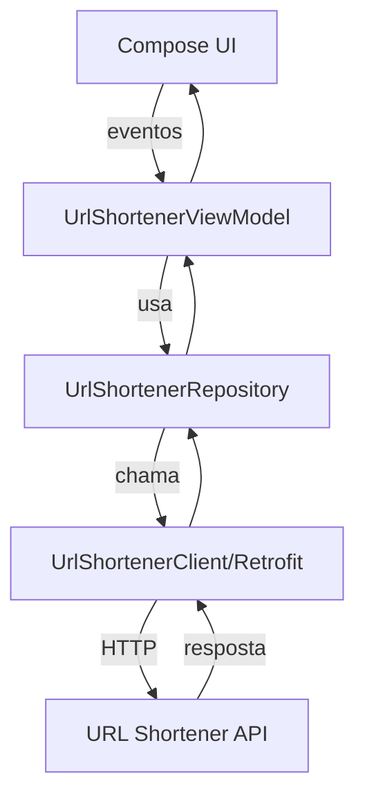

# URLShortener
Um app Android simples para encurtar URLs, feito em Kotlin com Jetpack Compose.

## Nome do projeto
URLShortener

## Arquitetura utilizada
- MVVM com separacao por camadas (`data`, `domain`, `ui`, `viewmodel`)
- Repository para acesso a dados remotos (Retrofit)
- Estado da UI exposto via `StateFlow`/`State` e consumido por Compose
- Construcao manual de dependencias no `ViewModel` (factory)

## Dependencias e tecnologias utilizadas
- Kotlin + Coroutines
- Jetpack Compose (UI)
- AndroidX ViewModel e Lifecycle
- Navigation Compose
- Retrofit + OkHttp (cliente HTTP)
- Gson Converter
- Splash Screen API
- Testes: JUnit4, JUnit5, MockK, Robolectric, Espresso, Compose UI Test
- Qualidade: Detekt, Ktlint, JaCoCo

## Fluxo de dados (alto nivel)
- Usuario interage com a tela (`UrlShortenerScreen`)
- UI envia eventos para o `UrlShortenerViewModel`
- ViewModel chama `UrlShortenerRepository`
- Repository acessa a API via `UrlShortenerClient` (Retrofit)
- DTOs sao convertidos para modelos de dominio
- ViewModel atualiza `StateFlow`/`State` e a UI reage

## Pontos de melhoria
- Adicionar injecao de dependencias (Hilt/Koin) para reduzir acoplamento
- Padronizar resultado de rede (sealed result) e erros mais ricos
- Melhorar validacao de URL e mensagens de erro (i18n)
- Extrair mapeamento DTO -> dominio para camada dedicada
- Adicionar cache local simples para ultimas URLs
- Criar flavors/variaveis de ambiente para `BASE_URL`
